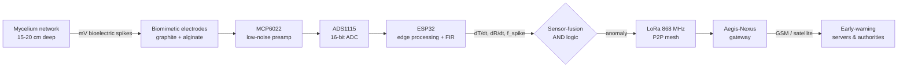

<div align="center">

# 🍄🛡️ Mycellium‑Aegis

### Living mycelium biosensors for **pre‑ignition** forest‑fire early warning
*Miselyum ağları tabanlı biyosensörlerle orman yangını erken uyarısı*

Detecting a wildfire **before the first flame** — by listening to the electrical activity of fungal networks 15–20 cm underground.

<br>


</div>

---

## 📖 Table of Contents

- [The one‑paragraph pitch](#-the-one-paragraph-pitch)
- [Why the current early‑warning stack is too late](#-why-the-current-early-warning-stack-is-too-late)
- [The core idea](#-the-core-idea)
- [How the system works](#-how-the-system-works)
- [The detection algorithm](#-the-detection-algorithm-sensor-fusion)
- [Hardware & measurement chain](#-hardware--measurement-chain)
- [Laboratory validation (Experiments 1 & 2)](#-laboratory-validation)
- [Pyrophilic fungi & biodegradable housing](#-pyrophilic-fungi--biodegradable-housing)
- [Communication & power](#-communication--power)
- [R&D roadmap (18 months)](#-rd-roadmap-18-months)
- [Risk assessment](#-risk-assessment)
- [Commercialization](#-commercialization-tübi̇tak-1812-bigg)
- [Team](#-team)
- [Repository contents](#-repository-contents)
- [Intro video (Higgsfield)](#-intro-video-higgsfield)
- [Scientific references](#-scientific-references)

---

## 🎯 The one‑paragraph pitch

**Mycellium‑Aegis** is a proactive, bio‑hybrid early‑warning system that turns the forest floor's own fungal mycelium into a living sensor network. A wildfire is preceded — minutes to hours before any flame, smoke, or thermal radiation — by a sub‑surface signature: rapid capillary‑water loss and a slow heat‑flux rise. Mycelium networks react to that abiotic stress with **measurable, millivolt‑scale electrical spikes**. By burying bio‑hybrid sensors at 15–20 cm depth and fusing three independent signals (heat‑flux rate, drying rate, and bioelectric spiking), Mycellium‑Aegis aims to raise the alarm during the **pre‑ignition phase** that today's camera/satellite/UAV systems structurally cannot see.

---

## 🔥 Why the current early‑warning stack is too late

Today's wildfire detection relies on satellite imaging, UAVs, cameras, and wireless sensor networks. They share one blind spot: **they only detect a fire after flame, heat radiation, or smoke already exists.** By then the fire has started.

Mycellium‑Aegis moves the detection window *earlier* — to the pre‑ignition stage, monitoring the sub‑surface moisture loss and heat build‑up that precede tutuşma (ignition) itself.

```
        Ignition timeline
        ─────────────────────────────────────────────▶  time
  ┌───────────────┬───────────────┬──────────────┬─────────────┐
  │ sub-surface   │  smouldering  │   flame      │   smoke     │
  │ drying + heat │               │              │  plume      │
  └───────────────┴───────────────┴──────────────┴─────────────┘
   ▲ Mycellium-Aegis            ▲ cameras / satellites / UAVs
     detects HERE                 detect HERE (too late)
```

---

## 💡 The core idea

Underground **mycelial networks** — the thread‑like hyphal structures of fungi — transport water and nutrients between plants and generate electrical responses to environmental stress. Recent electrophysiology (Adamatzky et al.) shows these networks produce reproducible, directional voltage **spikes** in response to heat, moisture loss, and physical damage.

At **15–20 cm depth**, the soil forms a "safe zone": surface flame temperatures above 900 °C attenuate logarithmically and arrive as a slow, damped wave of only **25–50 °C** — cool enough that the mycelium survives and keeps signalling, but coupled tightly enough to the surface that a fire's onset is detectable through **electrical resistance and voltage changes**.

| Depth | Max temperature | Effect on biological networks |
|------:|:----------------|:------------------------------|
| 0–2 cm | 300–850 °C+ | Near‑total destruction; cells carbonize |
| 2–5 cm | 80–150 °C | Partial damage; heat‑tolerant species & spores survive |
| 5–10 cm | 50–80 °C | Most mesophiles die; **pyrophilic fungi activate** |
| **15–20 cm** | **25–50 °C (safe zone)** | **Mycelium stays alive and keeps sensing** |

---

## ⚙️ How the system works



Each buried node reads the mycelium's bioelectric signal, pre‑amplifies and digitizes it, runs edge signal‑processing on the ESP32, evaluates the fusion rule locally, and — only when a fire onset is confirmed — forwards the event over a low‑power LoRa mesh to a gateway and onward to the authorities.

---

## 🧮 The detection algorithm (sensor fusion)

Fixed thresholds ("alarm if temperature > 30 °C") fail in a forest, where seasonal and daily swings are normal and would trigger false alarms. Mycellium‑Aegis instead watches **rates of change** (derivatives) and fuses three independent parameters:

| Signal | Condition | What it captures |
|:-------|:----------|:-----------------|
| **Heat‑flux rate** `dT/dt` | `> β` (e.g. 1.5 °C / 10 min) | Abnormal heat inflow (natural rate ≈ 0.05 °C/h at 20 cm) |
| **Drying rate** `d(ln R)/dt` | `> γ` | Fire‑driven capillary water loss → sharp conductivity drop (minutes, not days) |
| **Bioelectric spiking** `f_spike` | `> baseline + 3σ` for Δt | Osmotic‑stress spike bursts; star electrodes even resolve *direction* |

The decision is an **AND** of all three — a combination that natural drought or a hot summer day cannot produce simultaneously:

```
Alarm = (dT/dt > β)  AND  (d(ln R)/dt > γ)  AND  (spike_active = TRUE)
```

Only capillary drying → classified as **drought**. All three at once → **fire onset confirmed**, forwarded to the comms module. Neighbouring nodes' readings are cross‑checked for extra confidence.

> The frequency‑domain shift observed in the lab (dominant band moving from ≈20 Hz at rest to ≈5 Hz under thermal stress, see below) is the physical basis for automating this classification with an **LSTM** time‑series model — targeting a false‑positive rate **< 1 %**. The full machine‑learning approach — data pipeline, model architecture and alternatives, training/evaluation protocol, edge deployment, and MLOps — is written up in APA 7 style in [`docs/ai-plan/`](./docs/ai-plan/).

---

## 🔌 Hardware & measurement chain

The raw mycelial signal is millivolt‑scale, so the chain is built for low‑noise, high‑resolution differential measurement:

| Component | Role | Detail |
|:----------|:-----|:-------|
| **ESP32** (Xtensa LX6, 240 MHz) | Main MCU | Wi‑Fi/BLE, deep‑sleep, edge DSP |
| **ADS1115** | 16‑bit ΣΔ ADC | 4‑channel, programmable gain (PGA), I²C `0x48` |
| **MCP6022** | Low‑noise op‑amp | Dual‑channel electrode preamplifier |
| **Biomimetic electrodes** | Signal pickup | Stainless core + graphite matrix + sodium‑alginate hydrogel coating |
| **LoRa 868 MHz** | Comms | LoRaWAN P2P mesh transceiver |
| **Solar 5 W + LiFePO₄** | Power | Self‑powered, maintenance‑free operation |

---

## 🧪 Laboratory validation

Two escalating experiments (İYTE, May 2026) validate the founding hypothesis — *that mycelium answers thermal stress with measurable, distinguishable bioelectric signals* — and provide evidence for the **TRL 3→4** milestone.

### Experiment 1 — Single *Pleurotus ostreatus* (oyster mushroom)

Single differential channel, `GAIN_SIXTEEN` (±0.256 V, 7.8125 µV/bit), ~45 Hz, raw (no filter, no offset calibration).

| Metric | Resting (normal) | Fire stress |
|:-------|:-----------------|:------------|
| Voltage range | −29.4 mV … +0.1 mV | min −33.4 mV (Δ = **−4.0 mV**) |
| Mean voltage | −2.9 mV | −2.94 mV |
| Dominant frequency (FFT) | **≈ 20 Hz** | **≈ 5 Hz** (harmonic amplitude rises sharply) |
| Samples | N = 1048 | N = 1085 |

➡️ **A clear stress signature appears in both amplitude and frequency domains.** Heat stress increases ion‑channel activity, shifting the dominant band from ~20 Hz to ~5 Hz.

### Experiment 2 — Mycelium network in a terrarium (soil, rock, organics)

Moves toward field realism: an active mycelium network in a layered forest‑floor mock‑up, measured from **two** differential channels simultaneously.

| Parameter | Experiment 1 | Experiment 2 |
|:----------|:-------------|:-------------|
| Subject | Single mushroom tissue | Active soil/mycelium network |
| Channels | 1 differential | **2 differential** (network mapping) |
| PGA gain | `GAIN_SIXTEEN` (±0.256 V) | `GAIN_TWOTHIRDS` (±6.144 V, 24× range) |
| Resolution | 7.8 µV/bit | 187.5 µV/bit |
| Sample rate | ≈45 Hz | **≈100 Hz** (Nyquist 50 Hz covers 5 Hz APs) |
| Filtering | None (raw) | **5‑tap linear‑phase FIR** `[0.1, 0.2, 0.4, 0.2, 0.1]` |
| Offset calibration | None | **Automatic** (50‑sample baseline) |

Key firmware/DSP upgrades: the wider PGA range absorbs the soil–electrode DC offset and impedance swings that saturated Experiment 1; automatic offset calibration removes the electrode‑substrate DC component; the symmetric FIR (Σhₖ = 1.0, unity DC gain, distortion‑free phase) suppresses environmental/EMI noise; two channels enable, for the first time, mapping thermal‑stress **propagation across the network** rather than at a single point.

> **Next:** merge Experiment 1 & 2 datasets to train a PyTorch/LSTM classifier (target FP < 1 %), integrate a Savitzky‑Golay hardware filter, and add the LoRaWAN layer for open‑air pilot testing.

---

## 🌱 Pyrophilic fungi & biodegradable housing

Mycellium‑Aegis is designed to **survive the fire and heal the soil afterward** — not to become inert e‑waste.

- **Fire‑adapted (pyrophilic) species** — *Pyronema domesticum*, *Rhizina undulata* — are *activated*, not killed, by the 30–50 °C rise at depth (heat‑shock germination; expanded HSP20 and glutathione‑S‑transferase families). Post‑fire they metabolize pyrogenic organic matter (PyOM), contributing to soil restoration.
- **Fire‑resistant biocomposite housing** from agricultural waste (rice husk) + silica‑reinforced mycelium. On burning it forms a protective **Si‑O‑C char layer** that slows heat ingress.

| Material | Ignition / heat limit | Char layer | Environmental fit |
|:---------|:----------------------|:-----------|:------------------|
| PVC / plastic | ~150–200 °C, melts, toxic smoke | None | Persists for centuries |
| Expanded polystyrene (EPS) | Ignites fast, high heat release | None, melts in seconds | Hard to recycle |
| **Silica‑mycelium composite (proposed)** | **~200.5 °C**, 40.4 % residual mass | **Protective Si‑O‑C forms** | **Biodegradable; aids post‑fire soil** |

---

## 📡 Communication & power

Forest RF is harsh; Wi‑Fi and GSM lose signal under canopy and drain batteries. Mycellium‑Aegis uses **LoRa (868 MHz ISM)**:

- 24‑bit ADC readings → ESP32‑LoRa nodes in insulated buried enclosures
- **P2P mesh** with **1.5 km – 15 km** error‑free range even in dense forest
- Nodes relay to an **Aegis‑Nexus gateway** → GSM/satellite → early‑warning servers
- **Energy harvesting** (5 W solar + LiFePO₄, with thermoelectric/piezoelectric options) for long‑term, maintenance‑free operation

---

## 🗺️ R&D roadmap (18 months)

From "Month 0" (Excellence Seal obtained after the BİGG Stage‑1 accelerator), toward a field‑validated commercial prototype.

| Work package | Focus | Window | Output / TRL |
|:-------------|:------|:-------|:-------------|
| **WP‑1** Biocomposite & culture | Rice‑husk/silica matrix; *Pyronema domesticum* inoculation; mould biodegradable housing | M1–3 | 100 integrated‑electrode housings · TRL 3→4 |
| **WP‑2** Climate chamber & thresholds | 15–20 cm soil simulation; radiant heat shock; log `dT/dt`, `dR/dt` on 24‑bit ADC | M4–7 | β, γ coefficients fixed at 98 % confidence · TRL 4→5 |
| **WP‑3** Signal processing & LoRa | Spike de‑noising; event‑driven MCU code; P2P LoRaWAN; energy‑harvest tuning; PCB | M6–9 | Low‑latency anomaly relay; PCB done · TRL 5→6 |
| **WP‑4** Field prototype | Sensors buried in an authorized forest plot; small controlled burn with synchronous logging | M9–11 | Pre‑flame detection to server; durability · TRL 6→7 |
| **WP‑5** AI & patent | LSTM classifier (FP < 1 %); TÜRKPATENT filing; follow‑on investment talks | M11–15 | Patent application; tender‑compliance docs |
| **WP‑6** Commercial MVP | First B2B/B2G MVP site & reference data | M15–18 | Reference deployment · TRL 6→7 |

---

## ⚠️ Risk assessment

| Risk | Mitigation |
|:-----|:-----------|
| **False alarms** (summer drought / sub‑surface heat mistaken for fire) | Three‑signal **AND** fusion; drought vs. fire classification; neighbour‑node cross‑check |
| **Biotic/abiotic damage** (insects, rodents, microbial competitors) | Mycelium **self‑healing**; silica outer layer as physical barrier |
| **Electrode corrosion** (ionic soil) | Platinum‑coated carbon or differential Ag/AgCl electrodes to preserve SNR |

---

## 💰 Commercialization (TÜBİTAK 1812 BİGG)

Mycellium‑Aegis targets the **TÜBİTAK 1812 "Investment‑Based Entrepreneurship Support Program"** under the **Green Growth** call — matching three thematic focuses: *climate/biodiversity* (forest protection, lower fire emissions), *smart infrastructure* (IoT early warning), and *clean & circular economy* (biodegradable hardware).

- **Seed:** 1,350,000 TL for 3 % equity at Stage‑2 "Excellence Seal" (TRL 6–7 target)
- **Follow‑on:** up to +1,350,000 TL; via GCIP (Global Cleantech Innovation Programme) up to 2,250,000 TL for 5 %
- **Vehicle:** Mycellium‑Aegis A.Ş. (to be founded), incubated at İYTE Teknopark
- **Pilot partners:** Ege Orman Vakfı & OGM (forestry) plots, İYTE — with intent letters from the regional Forestry Directorate and İYTE
- **Compliance path:** CE marking, RoHS, BTK 868 MHz RF certification, TÜRKPATENT filing for the biomimetic electrode

**18‑month budget — 1,350,000 TL total**

| Category | Amount (TL) |
|:---------|------------:|
| Personnel | 720,000 |
| Equipment / software | 350,000 |
| Materials | 119,000 |
| Services (CE/RoHS, BTK, patent) | 85,000 |
| Other (rent, field logistics, incorporation) | 76,000 |
| **Total** | **1,350,000** |

---

## 👥 Team

| Member | Role | Focus |
|:-------|:-----|:------|
| **Mehmet Çetin** | Founder · CEO | Project lead — system architecture & business development |
| **Muhammet Yağcıoğlu** | Founder · CTO | Software & AI — LSTM / sensor fusion |
| **Ömer Ünal** | Founder · COO | Embedded hardware & IoT systems engineering |
| **Mahmut Can Göçlü** | Founder · CRO | Biomaterials & electrode R&D |

Conducted within the **İzmir Institute of Technology (İYTE)** ecosystem.

---

## 📂 Repository contents

This repository holds the TÜBİTAK 1812 BİGG application dossier and supporting technical evidence, organized into folders:

```
docs/
├── research/           # Scientific evaluation & R&D roadmap (the "why" and the physics)
├── experiments/        # Electrophysiology experiments 1 & 2 — hardware, firmware, results
├── ai-plan/            # AI & signal-intelligence plan (APA 7) — LSTM sensor fusion, edge AI
├── business-plan/      # Cost form / 18-month budget breakdown
├── letters-of-intent/  # Niyet mektupları — OGM Regional Directorate, İYTE
└── team-cvs/           # Team CVs (özgeçmişler)
higgsfield/
└── INTRO_VIDEO.md      # Intro-video kit: setup + storyboard + prompts + commands (all in one)
archive/
└── prodis-portal/      # Incidental TÜBİTAK PRODİS portal exports + web assets (not part of the product)
```

| Folder | Contents |
|:-------|:---------|
| [`docs/research/`](./docs/research/) | *Miselyum Elektriksel Aktivitesi Araştırması* — science & roadmap |
| [`docs/experiments/`](./docs/experiments/) | *Mantar Deney Raporu* — electrophysiology experiments 1 & 2 |
| [`docs/ai-plan/`](./docs/ai-plan/) | *AI & Signal-Intelligence Plan* (APA 7) — LSTM sensor fusion, edge AI, evaluation & MLOps |
| [`docs/business-plan/`](./docs/business-plan/) | *İş Planı Maliyet Formu* — 18‑month budget |
| [`docs/letters-of-intent/`](./docs/letters-of-intent/) | Letters of intent (OGM, İYTE) |
| [`docs/team-cvs/`](./docs/team-cvs/) | Team CVs |
| [`higgsfield/INTRO_VIDEO.md`](./higgsfield/INTRO_VIDEO.md) | Everything for the intro video, in one file |
| [`archive/prodis-portal/`](./archive/prodis-portal/) | Incidental PRODİS portal exports (not product) |

---

## 🎬 Intro video (Higgsfield)

A cinematic promo of Mycellium‑Aegis is scripted for generation with **[Higgsfield](https://higgsfield.ai)**. Everything — the three‑step setup, model choices, the 6‑shot (~36 s) storyboard, every prompt, the ready‑to‑run commands, and edit notes — lives in a single file: **[`higgsfield/INTRO_VIDEO.md`](./higgsfield/INTRO_VIDEO.md)**.

```bash
# 1 — Add the skills (already installed in this repo under .agents/skills/)
npx skills add higgsfield-ai/skills

# 2 — Install the CLI, then sign in (interactive, needs your Higgsfield account)
curl -fsSL https://raw.githubusercontent.com/higgsfield-ai/cli/main/install.sh | sh
higgsfield auth login

# 3 — Generate: run the commands in higgsfield/INTRO_VIDEO.md (§5)
```

---

## 📚 Scientific references

1. S. H. Doerr *et al.*, "Soil heating during wildfires and prescribed burns: A global evaluation," *Int. J. Wildland Fire*, 34(12), WF25103, 2025. doi:10.1071/WF25103
2. N. Phillips, A. Gandia, A. Adamatzky, "Electrical response of fungi to changing moisture content," *Fungal Biol. Biotechnol.*, 10(1):8, 2023. doi:10.1186/s40694‑023‑00155‑0
3. A. Adamatzky, "Towards fungal computer," *Interface Focus*, 8(6):20180029, 2018. doi:10.1098/rsfs.2018.0029
4. A. Adamatzky, "Fungal systems for security and resilience," *arXiv:2602.10543 [cs.ET]*, 2026.
5. A. Adamatzky, "Directional electrical spiking, bursting, and information propagation in oyster mycelium recorded with a star‑shaped electrode array," *arXiv:2601.08099 [cs.ET]*, 2026.
6. X. Zhang *et al.*, "Development and characterization of novelly grown fire‑resistant fungal fibers," *Sci. Rep.*, 12:10836, 2022. doi:10.1038/s41598‑022‑14806‑6
7. S. Makdee *et al.*, "The development of a wildfire early warning system using LoRa technology," *Computers*, 15(2):105, 2026. doi:10.3390/computers15020105
8. T. A. Duong *et al.*, "Thermotolerance and post‑fire growth in *Rhizina undulata*…," *BMC Genomics*, 26(1):1041, 2025. doi:10.1186/s12864‑025‑11902‑5
9. M. S. Fischer *et al.*, "Pyrolyzed substrates induce aromatic compound metabolism in the post‑fire fungus *Pyronema domesticum*," *Front. Microbiol.*, 12:729289, 2021. doi:10.3389/fmicb.2021.729289
10. TÜBİTAK, "TÜBİTAK BiGG ekosisteminde büyük değişiklik," 2023. [Online]. https://tubitak.gov.tr/tr/haber/tubitak-bigg-ekosisteminde-buyuk-degisiklik

---

<div align="center">

**Mycellium‑Aegis** — *hearing the forest before it burns.*
TÜBİTAK 1812 BİGG · İzmir Institute of Technology (İYTE) · 2026

</div>
